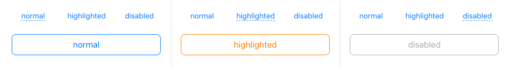
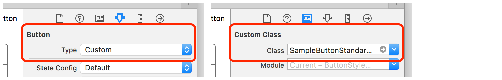

# ButtonStyleKit

ButtonStyleKit is helper library for UIButton custom styles.

## Requirements
- Swift 3.0
- iOS 8.0 or later

## Installation

### Carthage

* Cartfile

```Cartfile
github "keygx/ButtonStyleKit"
```
or

```Cartfile
github "keygx/ButtonStyleKit" "branch-name"
```
or

```Cartfile
github "keygx/ButtonStyleKit" "tag"
```

* install

```
$ carthage update
```
To integrate "ButtonStyleKit.framework" into your Xcode project

## Usage

### Standard Style Example



#### make custom style

```SampleButtonStandardStyle.swift
import UIKit
import ButtonStyleKit

final class SampleButtonStandardStyle: ButtonStyleStandardBase {
    
    private let buttonStyle = ButtonStyleBuilder()
    
    final override func initializedTrigger() {
        let blue = UIColor(red: 0.0/255.0, green: 122.0/255.0, blue: 255.0/255.0, alpha: 1.0)
        let white = UIColor.white
        let orange = UIColor.orange
        let lightGray = UIColor.lightGray
        let whiteImage = buttonStyle.createViewToImage(color: white)
        
        /*---------- Common Settings ----------*/
        buttonStyle
            .setButton(self)
            .setState(.all)
            .setFont(UIFont.systemFont(ofSize: 16))
            .setCornerRadius(8.0)
            .setBorderWidth(1.0)
            .setClipsToBounds(true)
            .setExclusiveTouch(true)
            .build()
        
        /*---------- For State Settings ----------*/
        buttonStyle
            .setState(.normal)
            .setTitle("normal")
            .setTitleColor(blue)
            .setBackgroundImage(whiteImage!)
            .setBorderColor(blue)
            .build()
        
        buttonStyle
            .setState(.highlighted)
            .setTitle("highlighted")
            .setTitleColor(orange)
            .setBackgroundImage(whiteImage!)
            .setBorderColor(orange)
            .build()
        
        buttonStyle
            .setState(.disabled)
            .setTitle("disabled")
            .setTitleColor(lightGray)
            .setBackgroundImage(whiteImage!)
            .setBorderColor(lightGray)
            .build()
        
        buttonStyle.apply()
    }
    
    final override var currentState: ButtonStyleKit.ButtonState {
        didSet {
            buttonStyle.apply()
        }
    }
}
``` 

#### storyboard settings

- set Button Type "Custom"
- set Custom Class "SampleButtonStandardStyle"




#### use viewcontroller

```ViewController.swift
import ButtonStyleKit

class ViewController: UIViewController {

    @IBOutlet weak var button: SampleButtonStandardStyle!
    
    ~~~
    
    button.setClickHandler { sender in
        print("clicked tag: \(sender.tag)")
    }
    
```

**For more information, please refer to the sample project**


## License

ButtonStyleKit is released under the MIT license. See LICENSE for details.

## Author

Yukihiko Kagiyama (keygx) <https://twitter.com/keygx>
